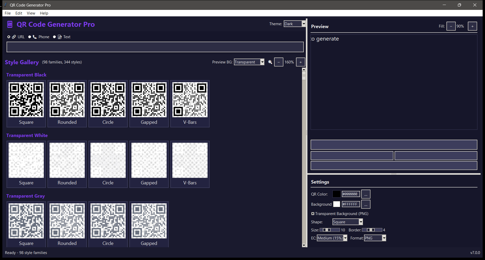

# 📱 QR Code Generator Pro

<div align="center">


**A professional QR code generator with a visual style gallery, 98 preset families, and extensive customization options.**

[Features](#-features) • [Installation](#-installation) • [Usage](#-usage) • [Style Gallery](#-style-gallery) • [Shortcuts](#-keyboard-shortcuts) • [License](#-license)

</div>

---




## ✨ Features

- **🎨 Visual Style Gallery** - 98 preset families with 344 style variations
- **🔍 Zoomable Interface** - Adjust gallery (60-200%) and preview (50-100%) sizes
- **🖼️ Transparent PNG Output** - All styles output transparent by default
- **🎯 Live Preview** - Auto-generates as you type with smart debouncing
- **🌈 Gradient Support** - Horizontal, vertical, radial, and square gradients
- **📐 Multiple Module Shapes** - Square, rounded, circle, gapped, vertical bars, horizontal bars
- **🎭 Gallery Background Picker** - Preview styles on different colored backgrounds
- **🌙 Theme Support** - Dark, Light, and Nord themes
- **⚡ Optimized Performance** - Batch loading, caching, and smooth scrolling
- **📋 Clipboard Support** - Copy QR image or data directly
- **💾 Multiple Export Formats** - PNG, JPEG, BMP, GIF, TIFF, WebP, SVG, PDF, EPS
- **🧩 Structured Payload Builders** - vCard, Wi-Fi, SMS, WhatsApp, email, crypto, geo, calendar, and OTP
- **🖼️ Logo and Print Tools** - Safe-zone logo overlays, favicon packs, sticker sheets, frames, and tiled backgrounds
- **🧪 Offline Validation** - Image/clipboard/webcam decoding and encode/decode round-trip checks
- **⚙️ Automation API** - Headless Python API, CLI, CSV batches, folder watch, ZIP export, and style grids

---

## 📸 Screenshots

<div align="center">

### Dark Theme with Style Gallery
*98 preset families organized by category with zoomable previews*

### Gradient Styles
*Beautiful gradient options including horizontal, vertical, and radial patterns*

### Neon & Retro Styles
*Cyberpunk-inspired neon colors and vintage terminal aesthetics*

</div>

---

## 🚀 Installation

### Prerequisites

- Python 3.8 or higher
- pip (Python package manager)

### Quick Start

1. **Clone the repository**
   ```bash
   git clone https://github.com/yourusername/qr-code-generator-pro.git
   cd qr-code-generator-pro
   ```

2. **Run the application**
   ```bash
   python qr_code_generator_pro_v7.py
   ```

   > **Note:** On first run, the application will automatically prompt to install required dependencies (`qrcode[pil]` and `Pillow`).

### Manual Dependency Installation

If you prefer to install dependencies manually:

```bash
pip install qrcode[pil] Pillow
```

### Optional: Clipboard Support (Windows)

For clipboard copy functionality on Windows:

```bash
pip install pywin32
```

---

## 📖 Usage

### Basic Workflow

1. **Enter your data**
   - Select input type: URL, Phone, or Text
   - Type or paste your content in the input field

2. **Choose a style**
   - Browse the Style Gallery (scrollable)
   - Click any style thumbnail to apply it
   - Use zoom controls to resize previews

3. **Customize (optional)**
   - Adjust QR color and background
   - Change module shape
   - Modify size, border, and error correction

4. **Export**
   - Click **Save** to export as file
   - Click **Copy** to copy to clipboard

### Headless CLI

The same renderer is available without opening the desktop window:

```bash
python qr_code_generator_pro_v7.py "https://example.com" --style neon-03 --logo icon.png --out qr.svg
python qr_code_generator_pro_v7.py --input-type wifi --payload-json '{"ssid":"Office","password":"secret","auth":"WPA"}' --out office.png
python qr_code_generator_pro_v7.py --batch-csv payloads.csv --column data --output-dir generated --zip generated.zip
```

Use `--help` for gradient angle, custom module masks, frame templates, PDF DPI/bleed, animated GIF/WebP, favicon, print-layout, decoder, webcam, and folder-watch options. Structured builder fields are JSON objects so scripts can produce the same payloads as the desktop forms.

### Input Types

| Type | Format | Example |
|------|--------|---------|
| **URL** | `https://...` | `https://github.com` |
| **Phone** | 7-15 digits | `+1234567890` |
| **Text** | Any text | `Hello World!` |

### Gallery Background Preview

Use the **Preview BG** dropdown to see how your transparent QR codes will look on different surfaces:

- **Transparent** - Checkerboard pattern (default)
- **White** - White paper/backgrounds
- **Light Gray** - Light surfaces
- **Dark Gray** - Dark surfaces
- **Black** - Maximum contrast testing
- **Custom...** - Pick any color

---

## 🎨 Style Gallery

### Style Categories

| Category | Families | Description |
|----------|----------|-------------|
| **Transparent** | 12 | Black, White, Gray, Navy, Red, Blue, Green, Purple, Orange, Teal, Pink, Gold |
| **Classic** | 2 | Traditional black/white and inverted |
| **Corporate** | 8 | Professional blues, grays, and greens |
| **Horizontal Gradients** | 18 | Blue-Purple, Sunset, Ocean, Candy, and more |
| **Radial Gradients** | 6 | Fire, Sunset, Ocean, Earth, Neon, Berry |
| **Vertical Gradients** | 6 | Sky, Dusk, Spring, Twilight, Sunrise, Lavender |
| **Neon** | 8 | Cyberpunk-inspired bright colors on dark |
| **Retro** | 5 | Terminal green, amber CRT, sepia tones |
| **Elegant** | 7 | Gold, Silver, Rose Gold, Bronze, Platinum |
| **Soft/Pastel** | 10 | Light, gentle colors for subtle designs |
| **Dark Mode** | 8 | Light colors on dark backgrounds |
| **Vibrant** | 8 | Bold, saturated colors |

### Module Shapes

Each style family includes variations with different module shapes:

- **Square** - Classic QR appearance
- **Rounded** - Soft, modern look
- **Circle** - Dotted pattern
- **Gapped** - Spaced squares
- **V-Bars** - Vertical bar pattern
- **H-Bars** - Horizontal bar pattern

---

## ⌨️ Keyboard Shortcuts

### File Operations

| Shortcut | Action |
|----------|--------|
| `Ctrl+N` | New QR code |
| `Ctrl+S` | Save QR code |
| `Ctrl+Q` | Quit application |

### Edit Operations

| Shortcut | Action |
|----------|--------|
| `Ctrl+V` | Paste data from clipboard |
| `Ctrl+C` | Copy QR image to clipboard |
| `Ctrl+Shift+C` | Copy data to clipboard |

### View Operations

| Shortcut | Action |
|----------|--------|
| `Ctrl++` | Zoom in gallery |
| `Ctrl+-` | Zoom out gallery |
| `F11` | Toggle fullscreen |

### Other

| Shortcut | Action |
|----------|--------|
| `Ctrl+G` / `F5` | Generate QR code |
| `F1` | Show help |

---

## ⚙️ Configuration

### Settings

| Setting | Range | Default | Description |
|---------|-------|---------|-------------|
| **Size** | 5-25 | 10 | QR module pixel size |
| **Border** | 0-10 | 4 | White space around QR |
| **Error Correction** | L/M/Q/H | Medium (15%) | Data recovery capability |
| **Format** | PNG/JPEG/BMP/GIF/TIFF | PNG | Export file format |

### Error Correction Levels

| Level | Recovery | Use Case |
|-------|----------|----------|
| **Low (7%)** | ~7% | Maximum data density |
| **Medium (15%)** | ~15% | Balanced (recommended) |
| **Quartile (25%)** | ~25% | Moderate damage tolerance |
| **High (30%)** | ~30% | Maximum damage tolerance |

---

## 🛠️ Technical Details

### Performance Optimizations

- **Batch Loading** - Gallery loads 12 previews per frame to maintain UI responsiveness
- **Checkerboard Caching** - 14x faster transparency preview rendering
- **Smart Debouncing** - 250ms delay prevents excessive regeneration
- **Smooth Scrolling** - Optimized scroll increments for fluid navigation

### File Locations

| Platform | Log Directory |
|----------|---------------|
| **Windows** | `%LOCALAPPDATA%\QRCodeGeneratorPro\` |
| **macOS** | `~/Library/Application Support/QRCodeGeneratorPro/` |
| **Linux** | `~/.config/qrcodegeneratorpro/` |

### Dependencies

| Package | Purpose |
|---------|---------|
| `qrcode[pil]` | QR code generation with styled output |
| `Pillow` | Image processing and manipulation |
| `pywin32` (optional) | Windows clipboard support |
| `opencv-python` (optional) | QR image and webcam decoding |
| `reportlab` (optional) | PDF and sticker-sheet export |
| `tkinterdnd2` (optional) | Native image drag-and-drop |

---

## 🤝 Contributing

Contributions are welcome! Here's how you can help:

1. **Fork** the repository
2. **Create** a feature branch (`git checkout -b feature/amazing-feature`)
3. **Commit** your changes (`git commit -m 'Add amazing feature'`)
4. **Push** to the branch (`git push origin feature/amazing-feature`)
5. **Open** a Pull Request

### Ideas for Contributions

- [ ] Add logo/image overlay support
- [ ] Batch QR code generation from CSV
- [ ] Custom gradient editor
- [ ] QR code reader/decoder
- [ ] Additional export formats (SVG, PDF)
- [ ] Preset import/export
- [ ] Localization support

---

## 📝 Changelog

### Version 8.0.0

- ✨ Added headless Python and CLI generation with structured payload builders, batch/watch/ZIP workflows, and preset/style-grid automation
- ✨ Added SVG, PDF, EPS, WebP/GIF animation, favicon-pack, print-layout, logo-overlay, frame, pattern, eye, and custom-mask exports
- ✨ Added image, clipboard, webcam, and round-trip decoding plus gradient editing, localization, native drag-and-drop, and keyboard-focused accessibility

### Version 7.0.0

- ✨ Added gallery background color picker
- ✨ Default gallery zoom increased to 160%
- ✨ All styles now output transparent by default
- ⚡ Batch gallery loading for better performance
- ⚡ Checkerboard pattern caching (14x faster)
- ⚡ Smoother scrolling experience
- 🐛 Fixed preview centering on window resize

### Version 6.0.0

- ✨ Added zoom controls for gallery and preview
- ✨ Resizable preview panel
- 🐛 Fixed preview centering issues

### Version 5.0.0

- ✨ Expanded to 98 preset families (344 variations)
- ✨ Added horizontal PanedWindow for resizable panels
- ✨ Transparent PNG output by default

### Previous Versions

- v4.0.0 - Visual style gallery with clickable thumbnails
- v3.0.0 - Menu bar, keyboard shortcuts, High DPI support
- v2.0.0 - 18 style presets, auto-dependency installation
- v1.0.0 - Initial release with basic QR generation

---

## 📄 License

This project is licensed under the MIT License - see the [LICENSE](LICENSE) file for details.

```
MIT License

Copyright (c) 2024 QR Code Generator Pro Team

Permission is hereby granted, free of charge, to any person obtaining a copy
of this software and associated documentation files (the "Software"), to deal
in the Software without restriction, including without limitation the rights
to use, copy, modify, merge, publish, distribute, sublicense, and/or sell
copies of the Software, and to permit persons to whom the Software is
furnished to do so, subject to the following conditions:

The above copyright notice and this permission notice shall be included in all
copies or substantial portions of the Software.

THE SOFTWARE IS PROVIDED "AS IS", WITHOUT WARRANTY OF ANY KIND, EXPRESS OR
IMPLIED, INCLUDING BUT NOT LIMITED TO THE WARRANTIES OF MERCHANTABILITY,
FITNESS FOR A PARTICULAR PURPOSE AND NONINFRINGEMENT. IN NO EVENT SHALL THE
AUTHORS OR COPYRIGHT HOLDERS BE LIABLE FOR ANY CLAIM, DAMAGES OR OTHER
LIABILITY, WHETHER IN AN ACTION OF CONTRACT, TORT OR OTHERWISE, ARISING FROM,
OUT OF OR IN CONNECTION WITH THE SOFTWARE OR THE USE OR OTHER DEALINGS IN THE
SOFTWARE.
```

---

## 🙏 Acknowledgments

- [python-qrcode](https://github.com/lincolnloop/python-qrcode) - QR code generation library
- [Pillow](https://python-pillow.org/) - Python Imaging Library
- All contributors and users of this project

---

<div align="center">

**Made with ❤️ for the QR code community**

[⬆ Back to Top](#-qr-code-generator-pro)

</div>
